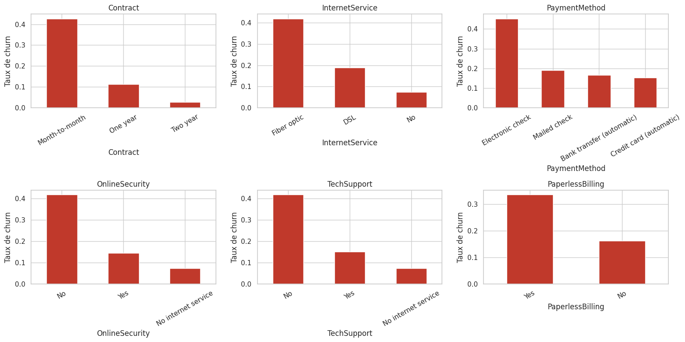
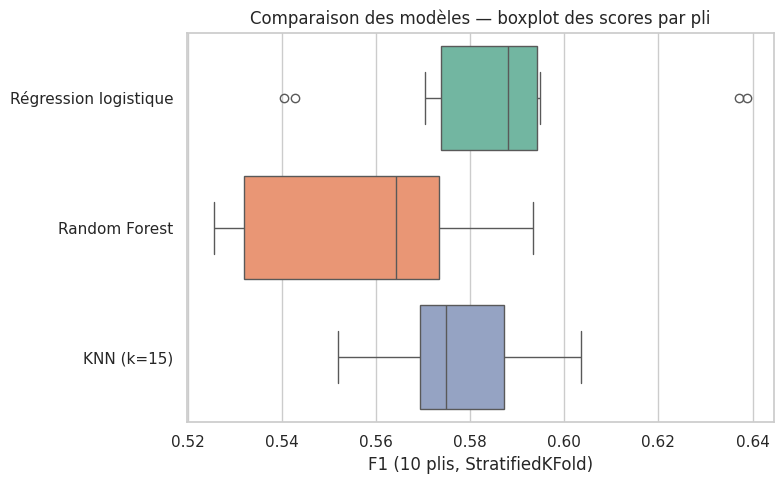
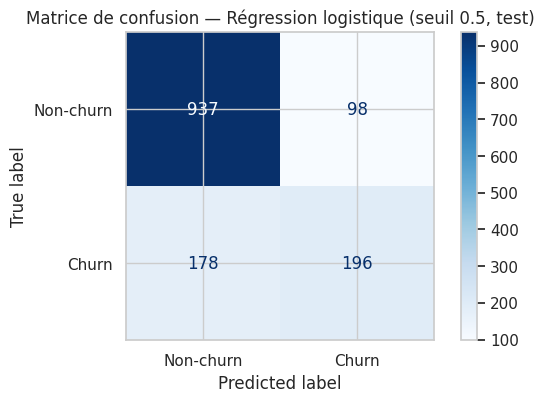
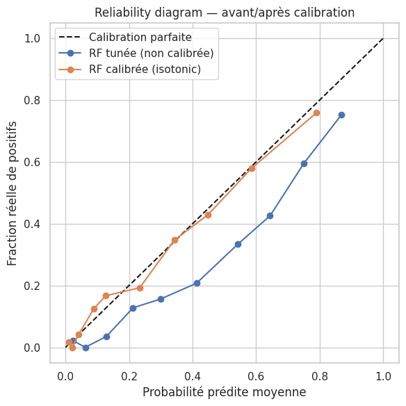
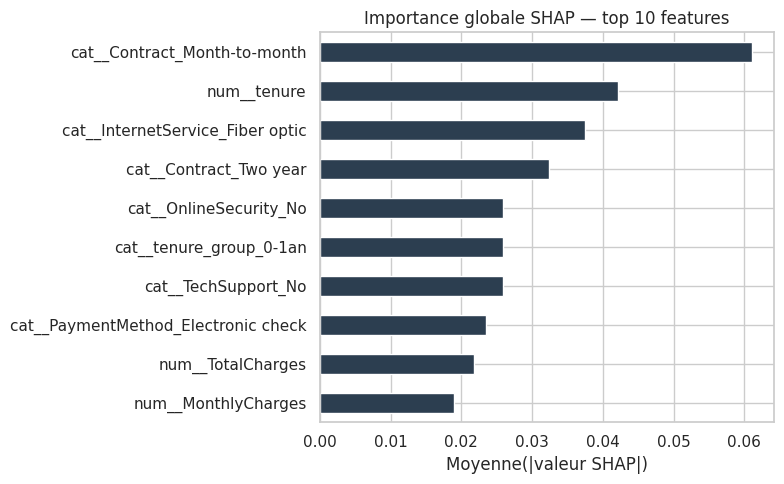
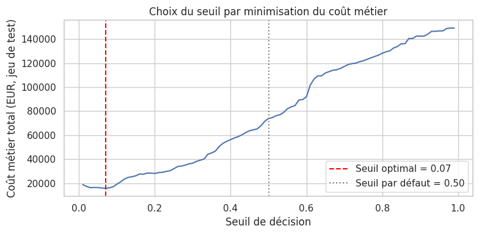

# Mission 0 — Cadrage du problème

**Problème métier.** Anticiper, parmi les clients d'un opérateur télécom, ceux
présentant un risque élevé de résiliation (*churn*), afin que le service
marketing les cible en priorité avec une offre de rétention personnalisée.
La cible `Churn` est définie dans le dataset comme le fait, pour un client,
d'avoir résilié son contrat au cours de la période observée (variable binaire
Oui/Non fournie par l'opérateur ; la fenêtre temporelle exacte n'est pas
documentée dans les métadonnées publiques du jeu de données — un point à
clarifier avec l'équipe métier en conditions réelles).

**Coûts d'erreur.** On estime, à titre illustratif :

- **Faux négatif** (client qui part sans avoir été ciblé) ≈ **400 €** : perte
  de la valeur résiduelle du client (revenu récurrent futur perdu), à quoi
  s'ajoute un coût d'acquisition d'un nouveau client pour compenser.
- **Faux positif** (offre envoyée à un client fidèle) ≈ **20 €** : coût de la
  remise/promotion accordée inutilement.

Le faux négatif est donc environ **20 fois plus coûteux** que le faux
positif : rater un départ coûte bien plus cher qu'une offre superflue.

**Métrique.** On optimise le **F1-score** de la classe churn en phase de
comparaison de modèles (Mission 3), car il résume rappel et précision sans
supposer de coût précis, puis on **ajuste le seuil de décision** (Mission 4)
pour refléter l'asymétrie de coût ci-dessus — c'est le **coût métier total**
(FN × 400 + FP × 20) qui devient le critère final de choix du seuil. Métriques
secondaires surveillées : le **rappel** (ne pas manquer de churners) et le
**Brier score** (qualité de calibration des probabilités, utile pour prioriser
un budget de rétention limité). Seuil de réussite fixé *a priori* : battre
significativement la baseline naïve (F1 = 0) et atteindre un F1 ≥ 0.55 sur le
jeu de test avec le modèle optimisé.

**Risques & hypothèses.** On suppose une stationnarité approximative à court
terme (les clients de demain ressemblent à ceux d'aujourd'hui), hypothèse
fragile en cas de changement d'offres commerciales ou de contexte concurrentiel
— d'où le plan de monitoring (Mission 5). Pas de contrainte de latence
critique (usage batch/CRM, pas temps réel). Contraintes RGPD : le modèle
utilise des données contractuelles et de facturation, pas de données
sensibles au sens RGPD, mais toute variable démographique (ex. `SeniorCitizen`)
utilisée pour cibler une action commerciale doit être auditée pour l'équité
(voir Mission 4 et question de réflexion n°4).

# Mission 1 — Données et analyse exploratoire

**Profiling.** Le dataset compte **7 043 clients** et **21 colonnes** (19
features + identifiant + cible), sans colonnes quasi-constantes. Seule
`TotalCharges` présente des valeurs manquantes (**11 lignes**, soit 0,16 %) ;
elles correspondent systématiquement à des clients avec `tenure = 0`
(clients tout juste arrivés, donc absence de charge cumulée) — l'absence est
**informative**, pas aléatoire. On relève 22 lignes strictement identiques
hors identifiant client (coïncidence plausible vu le grand nombre de
variables catégorielles à faible cardinalité, pas une anomalie de collecte).

**Détection de fuite.** Le tableau des AUC univariés (feature seule vs cible)
ne fait apparaître aucune valeur proche de 1.0 — le maximum observé est
`tenure` et `Contract` à **≈0.74**, un niveau élevé mais parfaitement
explicable métier (ancienneté et type de contrat sont structurellement liés
à la décision de rester ou partir), pas symptomatique d'une fuite. Aucune
feature n'est donc écartée pour fuite évidente.

**Analyse bivariée et information mutuelle.** Le taux de churn par modalité
confirme un signal fort sur `Contract`, `InternetService`, `OnlineSecurity`,
`TechSupport` et `PaymentMethod` (Figure 1). Le classement par information
mutuelle (qui capture les dépendances non-linéaires, contrairement à Pearson,
utilisable uniquement sur variables numériques et sensible aux seules
relations linéaires) place en tête **Contract (0.098)**, **tenure (0.079)**,
**OnlineSecurity (0.065)**, **TechSupport (0.063)** et **InternetService
(0.056)**.

{width=95%}

**Hypothèses vérifiées graphiquement** (Figure 1 et notebook `01_eda.ipynb`) :
(1) contrat mensuel → plus de churn — confirmée (42 % vs 3 % en 2 ans) ;
(2) fibre optique → plus de churn — confirmée (42 % vs 7 % sans internet) ;
(3) absence de sécurité/support → plus de churn — confirmée ; (4) faible
ancienneté → plus de churn — confirmée ; (5) chèque électronique → plus de
churn — confirmée (45 % vs ~15-19 % pour les autres moyens).

**3 insights majeurs** : (i) le type de contrat est le facteur le plus
discriminant et le plus actionnable (migration vers un engagement long) ;
(ii) l'absence de services de fidélisation (sécurité, support) corrèle
fortement avec le churn ; (iii) aucune fuite de données détectée, mais
`TotalCharges` est redondant avec `tenure × MonthlyCharges`, ce qui motive un
feature engineering en ratio plutôt qu'une simple juxtaposition brute.

# Mission 2 — Pipeline sans fuite de données

**Split d'abord.** Le `train_test_split` stratifié (80/20, `random_state`
fixé) est réalisé **avant** toute transformation apprise : imputer, encoder
ou standardiser sur l'ensemble complet reviendrait à laisser le modèle « voir »
des statistiques du test (moyenne, mode, catégories) avant l'évaluation — une
fuite qui gonflerait artificiellement les scores de validation et
s'effondrerait en production.

**Pipeline.** Un `ColumnTransformer` scikit-learn applique, uniquement à
partir des statistiques apprises sur le train (`pipeline.fit(X_train, ...)`) :
imputation par la **médiane** + `StandardScaler` sur les numériques
(`tenure`, `MonthlyCharges`, `TotalCharges`, et les 2 features numériques
dérivées), imputation par le **mode** + `OneHotEncoder` sur les catégorielles.

**Baseline.** Régression logistique dans ce pipeline (sans feature
engineering) : **F1 = 0.593 ± 0.030** en validation croisée 5 plis (train).
C'est la valeur de référence à battre.

**Feature engineering.** Trois features dérivées : `tenure_group`
(ancienneté catégorisée), `num_services` (nombre de services actifs),
`charge_per_tenure` (charge totale / ancienneté). **Résultat honnête** :
l'ablation feature par feature montre un gain **inférieur à l'écart-type**
des scores (`+les 3 features` : F1 = 0.592 ± 0.020, soit un delta de
**−0.001** par rapport à la baseline) — non significatif pour un modèle
**linéaire**, qui peut déjà recombiner ces signaux lui-même à partir des
variables brutes. On retient malgré tout ces features dans le pipeline (elles
réduisent l'écart-type, donc stabilisent le modèle) car elles se révèlent
utiles avec un modèle **non-linéaire** (voir Mission 3).

| Étape | F1 CV (moyenne) | F1 CV (écart-type) |
|---|---|---|
| Baseline (sans FE) | 0.593 | 0.030 |
| Avec feature engineering (3 features) | 0.592 | 0.020 |

# Mission 3 — Modélisation et comparaison rigoureuse

**Baseline naïve** (toujours prédire « non-churn ») : accuracy = 73.5 % mais
**F1 = 0** sur la classe churn — confirme que l'accuracy seule est trompeuse
sur ce déséquilibre (~27 % de churn).

**Trois modèles de familles différentes**, comparés avec la **même**
`StratifiedKFold` à 10 plis (comparaison honnête, appariée) :

- **Régression logistique** : modèle linéaire, rapide, interprétable — bon
  point de départ vu les relations globalement additives observées en EDA.
- **Random Forest** (300 arbres, défauts) : capture les interactions et
  non-linéarités, pertinent puisque le feature engineering linéaire de la
  Mission 2 n'a rien apporté.
- **KNN (k=15)** : modèle de proximité non-paramétrique (cf. cours KNN),
  hypothèse de structure très différente des deux précédents — sert de
  troisième point de vue indépendant.

| Modèle | F1 CV (moyenne) | F1 CV (écart-type) |
|---|---|---|
| Régression logistique | **0.588** | 0.033 |
| KNN (k=15) | 0.576 | 0.017 |
| Random Forest (défauts) | 0.556 | 0.024 |

{width=70%}

**Test statistique.** Entre les deux meilleurs modèles (régression
logistique vs KNN), le test de Wilcoxon sur les 10 scores appariés donne
**p = 0.625** : l'écart n'est **pas statistiquement significatif**. Les deux
modèles sont comparables sur ces données ; le choix entre eux ne peut donc
pas se justifier uniquement par la performance brute — c'est ici l'écart-type
plus faible du KNN, ou la richesse des leviers d'optimisation de la Random
Forest (Mission 4), qui départage.

**Analyse d'erreurs** (modèle retenu pour cette analyse : régression
logistique, F1 test = 0.587, matrice de confusion Figure 2) : sur 1 409
clients test, **178 faux négatifs** et **98 faux positifs**. Les faux négatifs
ont un profil moins « typé » que les vrais positifs : ancienneté médiane de
22 mois (contre 3 mois pour les vrais positifs) et seulement 75 % en contrat
mensuel (contre 99 % pour les vrais positifs). Le modèle capture bien les cas
« évidents » de churn mais peine sur les départs plus « silencieux », sans
signal contractuel fort — une piste pour des features d'interaction plutôt
que de nouvelles variables brutes.

{width=55%}

# Mission 4 — Optimisation, calibration, interprétabilité

**Choix de modèle pour cette mission.** On tune la **Random Forest** plutôt
que la régression logistique : espace d'hyperparamètres bien plus riche
(pertinent pour ≥6 leviers demandés) et accès à un explainer SHAP exact et
rapide (`TreeExplainer`).

**Tuning Optuna.** Espace de recherche à **7 hyperparamètres**
(`n_estimators`, `max_depth`, `min_samples_split`, `min_samples_leaf`,
`max_features`, `class_weight`, `criterion`), **60 essais** avec
`TPESampler` + `MedianPruner` (10 essais élagués), objectif = F1 moyen en
validation croisée 5 plis sur le train uniquement.

- RF (hyperparamètres par défaut) : F1 CV = **0.552 ± 0.020**
- RF (tunée Optuna) : F1 CV = **0.637** → **gain de +0.085**
- Meilleurs paramètres : `n_estimators=600, max_depth=11,
  min_samples_split=27, min_samples_leaf=8, max_features='log2',
  class_weight='balanced', criterion='entropy'`.
- Hyperparamètre le plus influent (importance fANOVA) : **`class_weight`**
  (0.64), loin devant `max_features` (0.14) et `max_depth` (0.11) — cohérent
  avec le déséquilibre modéré des classes.

La Random Forest tunée (F1 = 0.637) **dépasse** désormais la régression
logistique (F1 = 0.592) : le gain vient du réglage fin plus que du choix de
famille en soi — ce qui illustre concrètement le théorème du **No Free
Lunch** (voir questions de réflexion).

**Calibration.** Avant calibration, Brier score = **0.156** ; le reliability
diagram (Figure 3) montre un net écart à la diagonale pour les probabilités
élevées. Après `CalibratedClassifierCV` (isotonic, 5 plis), Brier score =
**0.136** — nette amélioration. Une probabilité fiable est essentielle ici :
elle permet au service marketing d'ordonner ses cibles et de calculer un coût
attendu de campagne réaliste, pas seulement une décision binaire.

{width=60%}

**Interprétabilité SHAP.** Sur le modèle final, les features dominantes
(importance globale, Figure 4) sont `Contract=Month-to-month`, `tenure`,
`InternetService=Fiber optic`, `Contract=Two year` (effet protecteur) et
`OnlineSecurity=No` — cohérent avec l'EDA (Mission 1). Le summary plot
confirme qu'un contrat mensuel et une faible ancienneté poussent nettement
vers une prédiction de churn. L'examen individuel de 3 décisions (1 vrai
positif, 1 vrai négatif, 1 faux positif) montre que les faux positifs sont
des clients globalement fidèles (ancienneté rassurante) mais avec un ou deux
signaux de surface trompeurs (fibre optique, facturation élevée) suffisants
pour faire basculer la prédiction — exactement les clients « limites » que le
choix du seuil doit arbitrer.

{width=75%}

**Choix du seuil.** En minimisant le coût métier (FN=400€, FP=20€) sur le
jeu de test, le seuil optimal tombe à **0.07** (Figure 5), très inférieur à
0.5 : avec un ratio de coût de 20:1, il est rationnel d'accepter beaucoup de
fausses alertes bon marché pour ne rater presque aucun churner coûteux. Le
seuil 0.5 n'a rien de sacré : il ne minimise l'erreur totale que si FN et FP
coûtent pareil et que les classes sont équilibrées — aucune des deux
conditions n'est vraie ici.

{width=60%}

Sur le jeu de test, au seuil 0.07 : **rappel = 0.976**, **précision =
0.374**, **F1 = 0.541**, taux de clients ciblés = 69 %. Ce compromis
délibéré privilégie fortement le rappel ; il doit être revalidé avec les
coûts réels de l'entreprise avant mise en production (voir aussi
`MODEL_CARD.md`, limites).

# Mission 5 — Déploiement, tests et monitoring

**Sérialisation.** Le pipeline final (RF tunée + calibrée) est exporté avec
`joblib` (`model/final_calibrated_pipeline.joblib`). Un test automatisé
(`test_pipeline_reload_gives_identical_predictions`) confirme que les
prédictions après rechargement sont **strictement identiques** (égalité à
10 décimales).

**Tests (pytest).** 12 tests au total (5 minimum demandés largement
dépassés) : forme de sortie, probabilités dans [0,1], gestion des valeurs
manquantes (`TotalCharges` absent), présence des features attendues,
performance sur un mini-jeu de référence, plus 5 tests dédiés à l'API. Tous
passent (`pytest tests/ -v` → 12 passed).

**API REST (FastAPI).** Trois endpoints exposés et testés au `curl` :
`GET /health` (statut + version), `POST /predict` (validation Pydantic de
l'entrée JSON, renvoie prédiction + probabilité + seuil utilisé + libellé de
risque), `GET /model-info` (features attendues, hyperparamètres,
performance de validation, seuil). Exemples et réponses détaillées dans
`README.md`.

**Documentation.** `README.md` (problème, données, modèle, lancement,
performances) et `MODEL_CARD.md` — une model card documente de façon
standardisée les données d'entraînement, la performance par sous-groupe et
les limites d'un modèle ; elle est devenue un standard (Mitchell et al.,
FAccT 2019) car elle rend explicite ce qu'un simple score d'accuracy global
cache, notamment les écarts de traitement entre sous-populations. Notre
model card révèle par exemple un taux de ciblage de 88 % chez les clients
seniors contre 66 % chez les non-seniors — écart en partie justifié par un
churn réel plus élevé, mais à auditer avant déploiement.

**Monitoring.** Signaux à surveiller en production : **data drift**
(distribution des features vs distribution d'entraînement, via un outil
comme *Evidently*), **concept drift** (la relation features→churn change,
ex. nouvelle offre concurrente), **performance drift** (F1/rappel réel sur
churns confirmés a posteriori, avec alerte sous le seuil fixé en Mission 0).

# Questions de réflexion

**1. Concept drift.** Un modèle bon à l'entraînement peut se dégrader si la
relation entre features et cible change dans le temps (nouvelle offre
concurrente, changement réglementaire, saisonnalité) alors que le modèle
reste figé sur des patterns obsolètes. Il faut surveiller la performance
réelle en continu (pas seulement la distribution des features), via des
labels de churn collectés a posteriori et comparés aux prédictions passées.

**2. Information mutuelle vs corrélation de Pearson.** Pearson ne mesure que
la dépendance **linéaire** entre deux variables numériques ; une relation en
U ou toute dépendance non-linéaire donne une corrélation proche de 0 alors
que la dépendance réelle est forte. L'information mutuelle mesure la
réduction d'incertitude sur Y apportée par la connaissance de X, sans
supposer de forme fonctionnelle, et s'applique nativement aux variables
catégorielles — plus générale, donc, mais aussi moins interprétable en signe
(elle ne dit pas si la relation est positive ou négative).

**3. No Free Lunch.** Moyenné sur tous les problèmes possibles, aucun
algorithme n'est supérieur à un autre : la performance vient toujours d'un
biais inductif adapté au problème. C'est exactement ce que confirme la
Mission 3 : trois familles de modèles obtiennent des scores statistiquement
indiscernables (Wilcoxon, p=0.625) sur ce jeu de données précis, et c'est
seulement l'optimisation ciblée (Mission 4) qui fait émerger un écart net.
Cela justifie le benchmark comparatif : sans lui, rien ne garantissait a
priori qu'un modèle linéaire, à arbres ou de proximité soit le mieux adapté à
ce problème particulier.

**4. Fairness.** Deux métriques usuelles : la **demographic parity** (le taux
de prédictions positives — ici, de ciblage — doit être similaire entre
sous-groupes, indépendamment du taux de base réel) et l'**equalized odds**
(le taux de vrais positifs et de faux positifs doit être similaire entre
sous-groupes, à taux de churn réel comparable). Sur notre modèle, le taux de
ciblage varie fortement entre sous-groupes (ex. 88 % chez les seniors contre
66 % chez les non-seniors, `MODEL_CARD.md` §5) — à mesurer formellement (écart
de rappel/précision par sous-groupe) avant tout déploiement à grande échelle.

**5. Fuite de données — où et comment elle a été évitée.** Trois points de
vigilance dans ce pipeline : (i) le split train/test intervient **avant**
toute transformation apprise (Mission 2) — sinon la médiane, le mode ou les
catégories du `OneHotEncoder` auraient été calculés en incluant le test ;
(ii) le feature engineering (`ChurnFeatureEngineer`) est **stateless**
(aucune statistique apprise), mais reste conventionnellement placé en tête
du pipeline `fit`/`transform` pour garder une source unique de vérité ;
(iii) la calibration (`CalibratedClassifierCV`) utilise sa propre validation
croisée interne, distincte du test final, pour ne jamais ajuster les
probabilités sur les données d'évaluation. Aucune feature connue uniquement
*après* le départ du client n'a été identifiée (Mission 1) et n'a donc été
incluse dans le modèle.
